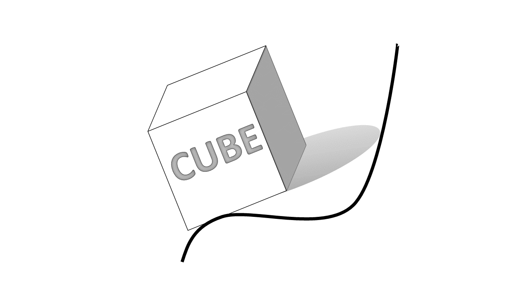
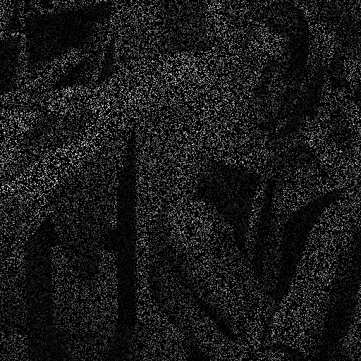
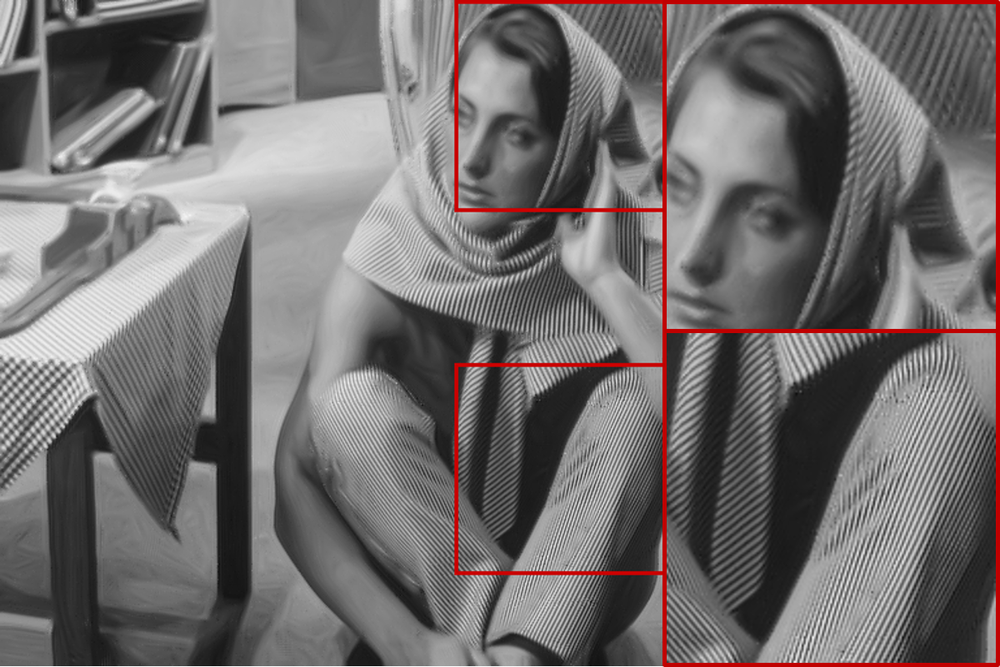
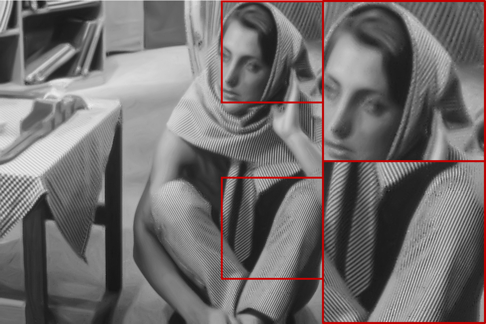
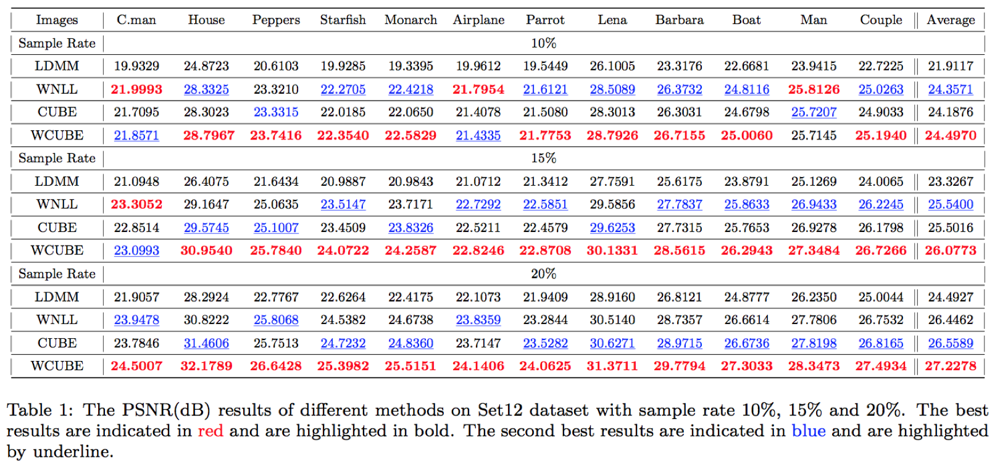
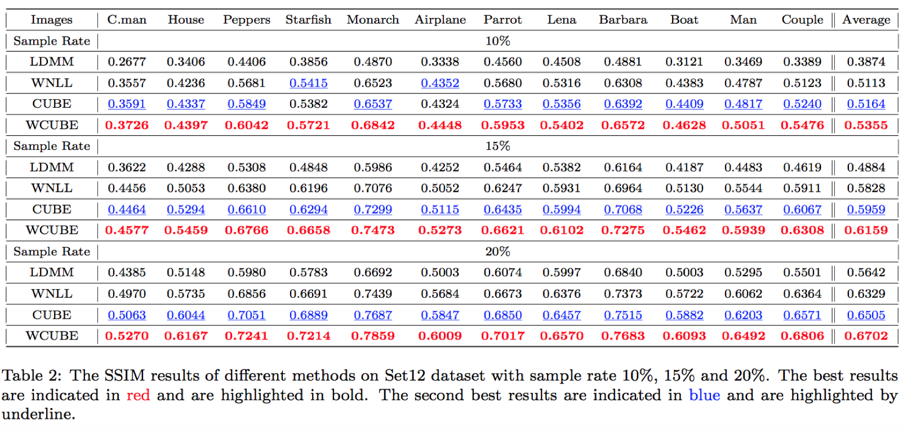
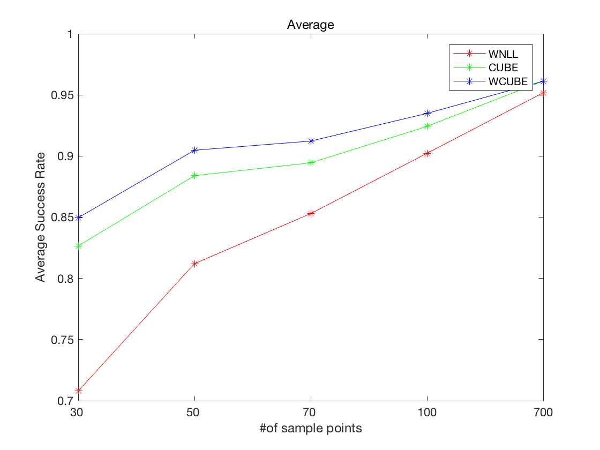

#  Github Repository For CUBE
## Regularize The Curvature Of Patch Manifold Via Biharmonic Extension

Code for "CUBE: Curvature Regularization Via Weighted Nonlocal BiHarmonic For Image Processing"

### Image Inpainting

(Ground Turth, Inpainting, Sample Rate:20%)

(Ground Turth, W-CUBE:28.56dB, WNLL:27.78dB)

PSNR

SSIM

### Semi-supervised Learning

In our test, we label 700, 100, 70, 50 and 35 images in MNIST respectively. The labeled images are selected at random in 70,000 images. For each sampling rate, we take 10 different random samples for comparisons.

### Image Denoising
